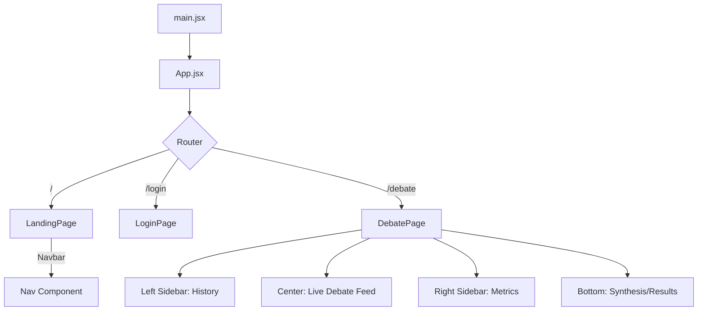
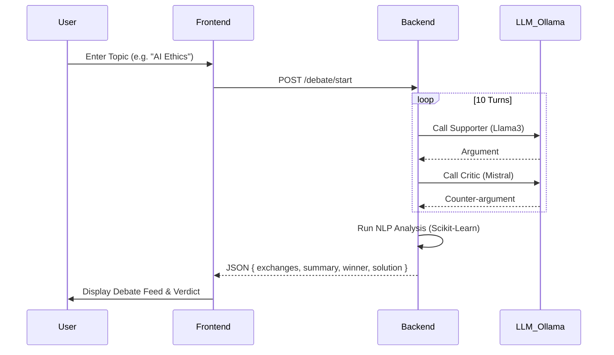

# GodMode AI: Frontend Architecture & Flow

This document provides a detailed breakdown of the frontend structure, routing logic, and data flow within the GodMode AI platform.

## 1. Component Hierarchy & Routing

The application follows a modular React structure with `react-router-dom` managing the navigation state.

## 2. Page-by-Page Workflow

### A. Landing Page (`/`)
*   **Purpose**: Brand positioning and conversion.
*   **Visuals**: Uses `SplineScene` for interactive 3D elements and `framer-motion` for reveal animations.
*   **Logic**: Simple navigation to `/login`.

### B. Login Page (`/login`)
*   **Purpose**: User authentication.
*   **Logic**: Validates input fields and performs a redirect to `/debate`. 
*   **Theme**: Minimalist "Paper" design with subtle background gradients.

### C. Workspace / Debate Page (`/debate`)
This is the most complex component, handling real-time state updates.

1.  **Initialization**: User enters a topic in the `ws-inp` field.
2.  **API Call**: `fetch('/debate/start', { topic })` is triggered.
3.  **State Management**:
    *   `isRunning`: Disables inputs and shows progress bars.
    *   `exchanges`: An array that grows as the backend streams (or returns) turns.
    *   `analysis`: Populated at the end of the debate with the final verdict.
4.  **Display Logic**:
    *   **Supporter**: Rendered on the left (White bubbles).
    *   **Critic**: Rendered on the right (Mint/Green bubbles).
    *   **Analyst**: Rendered at the bottom once the 10-turn loop completes.

## 3. Data Flow Model

## 4. Design System (CSS)
*   **Variables**: Centrally defined in `index.css` (:root).
*   **Responsiveness**: 
    *   **Desktop**: 3-column layout (Sidebar | Feed | Metrics).
    *   **Tablet/Mobile**: Single column stack with sidebars hidden or togglable.
*   **Aesthetics**: High-contrast typography (Inter/JetBrains Mono) combined with soft cream backgrounds for a "premium tool" feel.
