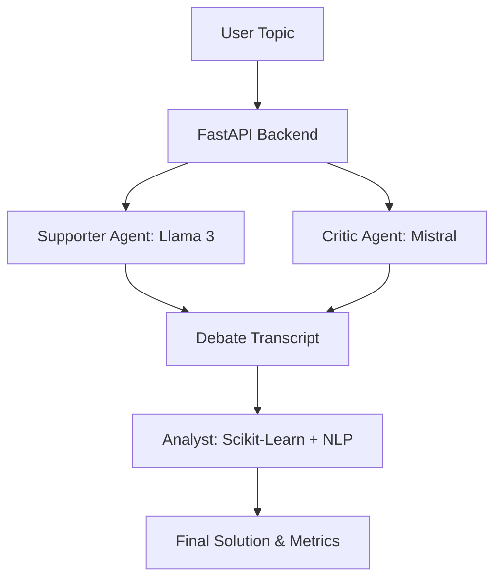

# GodMode AI: The "How It Works" Guide

Welcome to the internal workings of **GodMode AI**. This document explains our advanced multi-agent debate system in a way that is simple enough for a child to understand, yet precise enough for an engineer to appreciate.

---

## 1. The Big Picture
Imagine a **Digital Arena** where two specialized AI robots discuss a topic from opposite sides. A third robot acts as a referee, using math and logic to decide the outcome and provide a balanced solution.

---

## 2. Meet the Cast

### 🎙️ The Arguer (Optimax - Supporter)
*   **The Brain:** Llama 3 (via Ollama)
*   **The Role:** He is the ultimate optimist. No matter what the topic is, he finds the best reasons to support it. He builds the foundation of the debate.

### 🛡️ The Counter-Arguer (Skeptis - Critic)
*   **The Brain:** Mistral (via Ollama)
*   **The Role:** He is the professional skeptic. He looks for holes in the Supporter's logic and identifies risks that others might miss.

### ⚖️ The Referee (Synthesys - Analyst)
*   **The Tools:** Scikit-Learn (TF-IDF) & LLM
*   **The Role:** He doesn't take sides. He watches how many unique points each side makes and measures how much they actually disagreed versus just repeating each other.

---

## 3. The Three-Step Process

### Step 1: The Intellectual Duel
The Backend (FastAPI) coordinates a "back-and-forth" conversation.
*   The **Supporter** speaks first.
*   The **Critic** listens, then responds directly to what was said.
*   This repeats for a set number of rounds.
*   **Smart Feature:** We use "Context Truncation," meaning the robots only remember the most important recent parts of the fight to keep their thinking fast and focused.

### Step 2: The Math of Meaning (NLP)
Once the talking stops, we use **Deterministic NLP** (Non-AI math) to evaluate the text:
1.  **Keyword Mapping (TF-IDF):** We turn words into numbers to see which "concepts" were dominant.
2.  **Overlap Detection (Cosine Similarity):** We measure the "angle" between the two arguments. If the angle is small, they are saying the same thing. If it's large, they are truly debating.
3.  **Lexical Density:** We count unique ideas (word variety) to see who brought more "substance" to the table.

### Step 3: The Peace Treaty
Finally, we ask Llama 3 to act as a **Mediator**. It looks at the whole fight and writes a "Precise Solution."
*   **Constraint:** Maximum 3 lines.
*   **Goal:** Balance the growth potential (Supporter) with the risks (Critic).

---

## 4. Why This Design is "Perfect"

1.  **Privacy First:** Everything runs on **Ollama** (your local machine). Your data never leaves your computer.
2.  **Model Diversity:** By using **Llama 3** against **Mistral**, we prevent "groupthink." Each model has a different "personality" and training style.
3.  **Real-Time Streaming:** We use **Server-Sent Events (SSE)**. This means you see the debate as it happens, one word at a time, making the interface feel alive and responsive.
4.  **Error Resilience:** If a robot gets "confused" or takes too long, the system automatically tries again (Retries) without crashing the whole session.

---

**GodMode AI:** *Where complex arguments meet simple solutions.*
